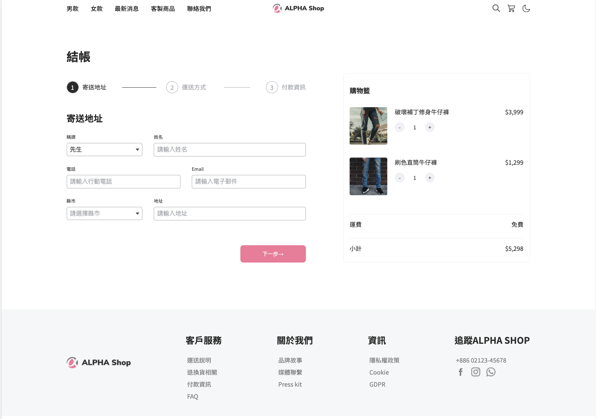

# ALPHA-Shop

##介紹

電商網頁RWD切版，以480px為web和mobile間的判別大小
左側分別有3個流程畫面，從輸入寄送個資、運送資訊到結帳程序
右側則為最終所購得商品品項與數量畫面

##功能
* web/mobile RWD切版
* 導覽列：會於mobile形式時呈現漢堡排狀態
* 表單切換：於「寄送地址、運送方式、付款資訊」不同狀態進行轉換
* 按鈕轉換：「上一步」、「下一步」進行操作切換
* 購物籃：固定呈現兩樣品項的圖片、價格、運費與總價，且每樣商品都有「＋」、「-」可進行增減數量，同時並不會產生畫面跳轉的情況。
* footer：於mobile形式會隱藏，不會呈現於畫面中。

##開發工具

* VScode
* Node.js
* SCSS
* Webpackage

